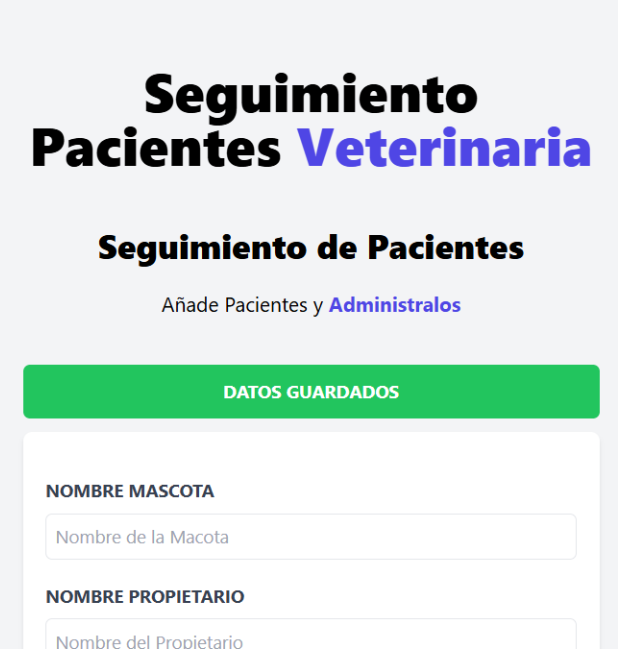

# Vue 3 + Vite

This template should help get you started developing with Vue 3 in Vite. The template uses Vue 3 `<script setup>` SFCs, check out the [script setup docs](https://v3.vuejs.org/api/sfc-script-setup.html#sfc-script-setup) to learn more.

Learn more about IDE Support for Vue in the [Vue Docs Scaling up Guide](https://vuejs.org/guide/scaling-up/tooling.html#ide-support).

🗓️ Proyecto actualizado el dia 20250829 a las 1:12 pm Colombia

©️ Autor: Luis Hernando Murcia Amortegui

📧 Contacto: luisamortegui.3691@gmail.com

🚀 Añadiendo dinamismo a nuestra alerta
Es de vital importancia mostrar alertas según sea el caso. Para los formularios es de vital importancia darle manejo a las alertas dependiendo de si este es vacío o está completo. Es por ello que se dispone de la librería computed para poder actuar como una bandera a nuestros datos. En este caso, podemos condicionar mediante una condición ternaria el valor adecuado.

✅ Vista

