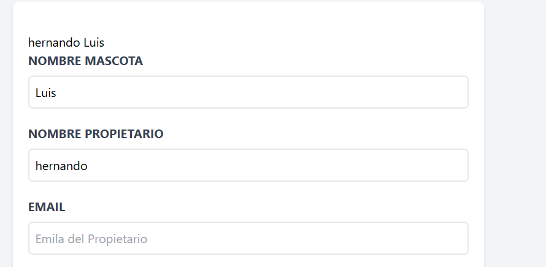

# Vue 3 + Vite

This template should help get you started developing with Vue 3 in Vite. The template uses Vue 3 `<script setup>` SFCs, check out the [script setup docs](https://v3.vuejs.org/api/sfc-script-setup.html#sfc-script-setup) to learn more.

Learn more about IDE Support for Vue in the [Vue Docs Scaling up Guide](https://vuejs.org/guide/scaling-up/tooling.html#ide-support).

🗓️ Proyecto actualizado el dia 20250829 a las 1:12 pm Colombia

©️ Autor: Luis Hernando Murcia Amortegui

📧 Contacto: luisamortegui.3691@gmail.com

🚀 Lectura de datos con reactive

La mejor opcion para almacenar un conjunto de datos es reactive. La funcion reactive toma cada uno de los campos y los almacena en cada propiedad del objeto, ya que con ref, en su efecto hay que crear varias declaraciones. Como en ref se sigue utilizando v-model, pero esta vez, para asignar e imprimir los valores se llama al objeto y con sintaxis de punto se llama la propiedad.

✅ Vista de como queda

