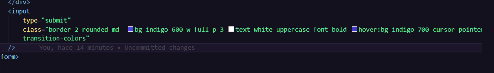

# Vue 3 + Vite

This template should help get you started developing with Vue 3 in Vite. The template uses Vue 3 `<script setup>` SFCs, check out the [script setup docs](https://v3.vuejs.org/api/sfc-script-setup.html#sfc-script-setup) to learn more.

Learn more about IDE Support for Vue in the [Vue Docs Scaling up Guide](https://vuejs.org/guide/scaling-up/tooling.html#ide-support).

🗓️ Proyecto actualizado el dia 20250829 a las 1:12 pm Colombia

©️ Autor: Luis Hernando Murcia Amortegui

📧 Contacto: luisamortegui.3691@gmail.com

🚀 Finalizando el diseño del formulario

Campos del formulario terminado, en el cual se puede evidenciar el estilo de cada campo con las clases de estilo de tailwindcss.

✅ Vista de como queda

🛠️ Diseño de los campos.

✅ Campo nombre mascota 

✅ Campo nombre propietario 

✅ Campo email

✅ Campo fecha de alta 

✅ Campo sintmas

✅ Boton input

